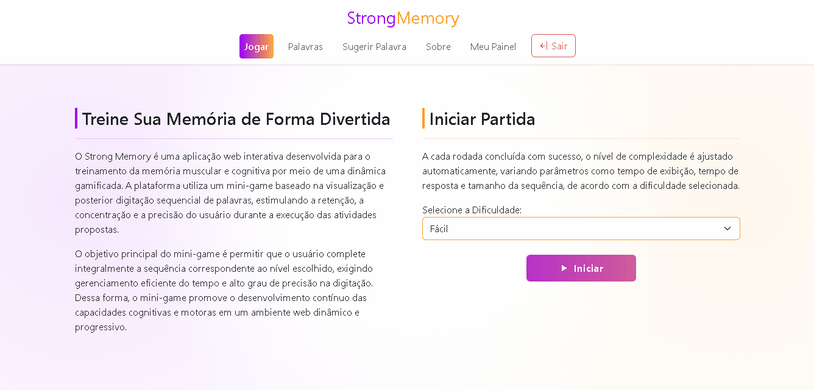

# 🎮 StrongMemoryWebApp

Interface web da aplicação **Strong Memory (SM)**, desenvolvida com Angular, responsável por proporcionar uma experiência interativa e gamificada para treinamento da memória muscular e cognitiva.

A aplicação consome uma API REST e oferece ao usuário uma dinâmica baseada na memorização e reprodução sequencial de palavras, com diferentes níveis de dificuldade, feedback em tempo real e acompanhamento de desempenho.

<br/>

## 🧠 Sobre o Projeto

O **SM** é uma aplicação web interativa que utiliza um mini-game para estimular habilidades cognitivas como:

- Memória
- Concentração
- Precisão
- Tempo de reação

A interface foi projetada com foco em:

- Experiência do usuário (UX)
- Responsividade
- Fluidez na interação
- Feedback visual imediato

<br />

## 🎮 Funcionalidades Principais

### 🧠 Mini-Game (Core da Aplicação)

- Exibição sequencial de palavras com tempo controlado
- Campo para digitação da sequência memorizada
- Feedback imediato (acerto/erro)
- Controle de tempo para resposta
- Sistema de níveis de dificuldade
- Reinício rápido da partida

### 📊 Dashboards

- Acompanhamento de desempenho
- Informações da conta do usuário

### 🔐 Autenticação e Sessão

- Login e cadastro de usuários
- Autenticação com JWT
- Controle de sessão
- Sistema de Access Token e Refresh Token
- Renovação automática de sessão
- Expiração e invalidação segura de tokens
- Logout seguro com revogação de refresh token
- Proteção de rotas autenticadas

### 📝 Gerenciamento de Palavras

- Listagem de palavras por dificuldade
- Paginação e ordenação
- Consumo de listas aleatórias para o mini-game

### 💡 Sugestão de Palavras

- Envio de sugestões pelo usuário
- Interface simples e intuitiva para contribuição

<br/>

## 🎥 Demonstração do Mini-Game



<br/>

## 🛠️ Tecnologias Utilizadas

- Angular 21
- TypeScript
- RxJS
- Angular Router
- Angular Forms
- Bootstrap / CSS
- JWT (integração com backend)

<br/>

## 🏗️ Arquitetura do Frontend

O projeto segue uma organização baseada em **features (modularização por domínio)**:

```
src/app/
 ├── core/            # Serviços globais (auth, interceptors, guards)
 ├── shared/          # Componentes reutilizáveis
 ├── features/
 │    ├── auth/       # Autenticação de usuários
 │    ├── dashboards/ # Dashboards de acompanhamento de desempenho
 │    ├── game/       # Lógica e ui do mini-game
 │    ├── public/     # Features públicas
 │    ├── users/      # Gestão de usuários
 │    ├── word-difficulties/ # Gestão de dificuldades
 │    ├── word-suggestions/  # Gestão de sugestões de palavras
 │    └── words/  # Gestão de palavras
```

### Boas práticas aplicadas:

- Separação por responsabilidade
- Lazy loading de módulos
- Uso de interceptors para autenticação
- Guards para proteção de rotas
- Componentização reutilizável

<br/>

## 🔗 Integração com Backend

A aplicação consome uma API REST desenvolvida com Spring Boot.

Principais integrações:

- Autenticação via JWT
- Consumo de palavras aleatórias para o mini-game
- Persistência de pontuação
- Gestão de usuários

<br/>

<!--
## ⚙️ Como Executar o Projeto

### 📋 Pré-requisitos

* Node.js (versão LTS recomendada)
* Angular CLI

---

### 🔧 Passos

```bash
# Clonar o repositório
git clone https://github.com/seu-usuario/strong-memory-web.git

# Entrar na pasta
cd strong-memory-web

# Instalar dependências
npm install

# Rodar aplicação
ng serve
```

A aplicação estará disponível em:

```
http://localhost:4200
```

---

## 🔐 Configuração de Ambiente

Configure a URL da API no arquivo de environment:

```ts
export const environment = {
  apiUrl: 'http://localhost:8080/api'
};
```
-->

## 🧩 Principais Fluxos da Aplicação

### 🎮 Fluxo do Jogo

1. Usuário inicia partida
2. Sistema exibe sequência de palavras
3. Usuário digita sequência
4. Sistema valida resposta
5. Exibe resultado (pontuação + status)
6. Atualiza score no backend

### 🔐 Fluxo de Autenticação

1. Usuário realiza login
2. Access Token e Refresh Token são gerados
3. Token JWT é armazenado no cliente
4. Interceptor adiciona o Access Token nas requisições autenticadas
5. Guards protegem rotas privadas da aplicação
6. Quando o Access Token expira, o Refresh Token é utilizado para renovação automática da sessão
7. Logout invalida o Refresh Token e encerra a sessão do usuário

<br/>

<!--
## 📈 Melhorias Futuras

* Implementação de testes (Jasmine / Karma)
* Animações mais avançadas (UX)
* Modo competitivo / ranking global
* PWA (Progressive Web App)
* Internacionalização (i18n)
* Tema dark/light

---
-->

## 🐳 Executar o Projeto Completo

Este repositório representa apenas uma parte do sistema Strong Memory.

Para executar toda a aplicação integrada (frontend + backend + banco de dados), utilize o ambiente completo com Docker:

👉 https://github.com/renan-teles/strong-memory-docker

Isso permite rodar o sistema completo com um único comando.

<br/>

## 👨‍💻 Autor

**Renan Lopes Lima Teles**

- GitHub: https://github.com/renan-teles
<!-- * LinkedIn: https://linkedin.com/in/seu-perfil -->

<br/>

## 📌 Observações

Este projeto foi desenvolvido com foco em:

- Construção de interfaces modernas com Angular
- Integração eficiente com APIs REST
- Aplicação de boas práticas de frontend
- Simulação de um produto real com foco em experiência do usuário

<br/>

<!--
💡 _Projeto ideal para demonstrar habilidades em Angular, arquitetura frontend, consumo de APIs e construção de aplicações interativas._
-->

<!--
# StrongMemoryApp


# StrongMemoryApp

This project was generated using [Angular CLI](https://github.com/angular/angular-cli) version 21.2.2.

## Development server

To start a local development server, run:

```bash
ng serve
```

Once the server is running, open your browser and navigate to `http://localhost:4200/`. The application will automatically reload whenever you modify any of the source files.

## Code scaffolding

Angular CLI includes powerful code scaffolding tools. To generate a new component, run:

```bash
ng generate component component-name
```

For a complete list of available schematics (such as `components`, `directives`, or `pipes`), run:

```bash
ng generate --help
```

## Building

To build the project run:

```bash
ng build
```

This will compile your project and store the build artifacts in the `dist/` directory. By default, the production build optimizes your application for performance and speed.

## Running unit tests

To execute unit tests with the [Vitest](https://vitest.dev/) test runner, use the following command:

```bash
ng test
```

## Running end-to-end tests

For end-to-end (e2e) testing, run:

```bash
ng e2e
```

Angular CLI does not come with an end-to-end testing framework by default. You can choose one that suits your needs.

## Additional Resources

For more information on using the Angular CLI, including detailed command references, visit the [Angular CLI Overview and Command Reference](https://angular.dev/tools/cli) page.
-->
